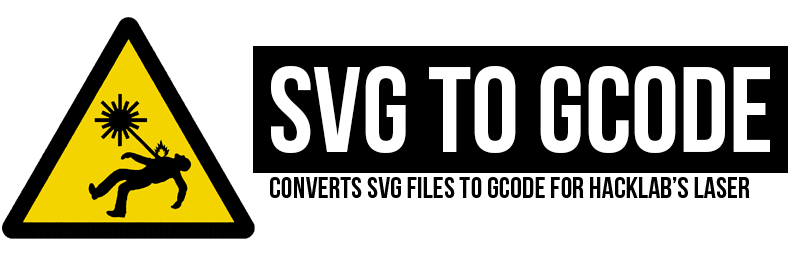
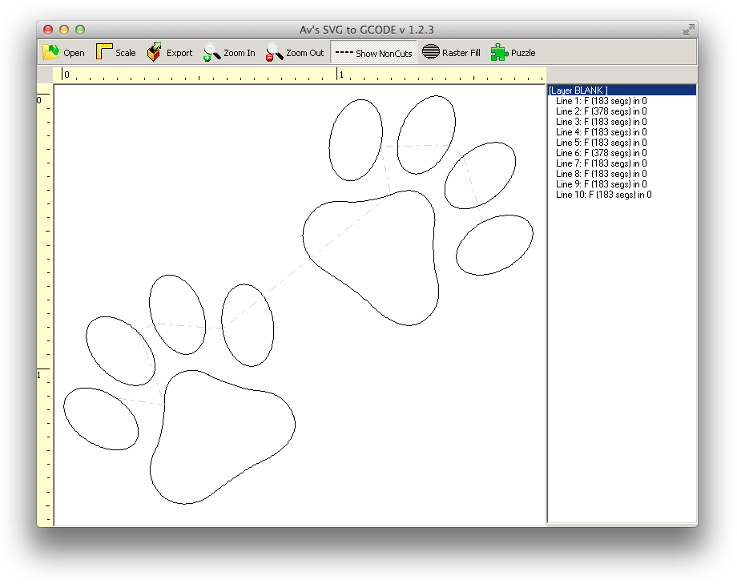

This program can read OpenSCAD, Inkscape, and Illustrator SVG files and produce GCode output.

As of version 1.2.3 there is standalone Mac support via emulation under Wine.

## Features

* OpenSCAD, Illustrator, Inkscape SVG support
* Rescale your SVG
* Repeat/Tile your SVG
* Raster filling
* Puzzle design
* Repeat SVG at multiple Z/depth positions
* Priotizes cutting "inner" paths before outer ones

## Download and Installation

### Windows

**Download [SVGtoGCODESetupV1.2.3.exe](releases/Windows/SVGtoGCODESetupV1.2.3.exe) and install**

### macOS/Mac OS X

**Download [SVGtoGCODE Standalone.app](releases/Mac/SVGtoGCODE Standalone.zip)** (78.3 MB)

If you already have Wine installed (preferably through [WineBottler](http://winebottler.kronenberg.org/)), you can use the slimmer app:

**Download [SVGtoGCODE.app](releases/Mac/SVGtoGCODE.zip)** (8.6 MB)

### Linux et al

[Wine](https://www.winehq.org/) is a pre-requisite for your system.

Same as Windows section. Download the latest installer file and run it under your Wine installation.

## License

See [LICENSE](LICENSE) file.

## Icon Credit

Big Scary Laser icon courtesy of [www.electricstuff.co.uk](http://www.electricstuff.co.uk/)
